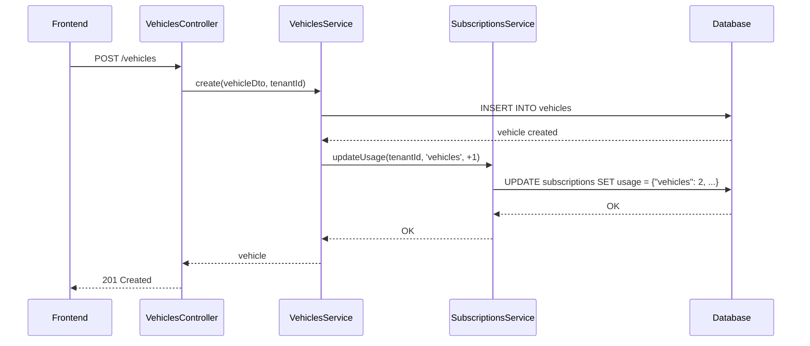

# ✅ FT1-008 - Suivi Automatique de l'Usage (Auto-Tracking)

**Date :** 2025-10-10
**Status :** ✅ IMPLÉMENTÉ
**Version :** 1.0

---

## 🎯 Objectif

Garantir que l'usage des ressources (véhicules, users, drivers) est **automatiquement synchronisé** dans la table `subscriptions` lors de :
- ✅ Création d'une ressource → +1
- ✅ Suppression d'une ressource → -1

---

## 📊 Vue d'Ensemble

### Avant (Problème)
```json
// subscription.usage avant la correction
{
  "users": 0,     // ❌ Alors qu'il y a 2 users
  "vehicles": ??, // ❌ Jamais mis à jour
  "drivers": ??   // ❌ Jamais mis à jour
}
```

### Après (Solution)
```json
// subscription.usage après la correction
{
  "users": 2,     // ✅ Auto-incrémenté à chaque création
  "vehicles": 1,  // ✅ Auto-incrémenté à chaque création
  "drivers": 0    // ✅ Auto-incrémenté à chaque création
}
```

---

## 🔧 Implémentation par Module

### 1️⃣ Vehicles Service ✅

**Fichier :** `backend/src/modules/vehicles/vehicles.service.ts`

#### Injection SubscriptionsService
```typescript
import { SubscriptionsService } from '../subscriptions/subscriptions.service';

constructor(
  // ...
  private readonly subscriptionsService: SubscriptionsService,
) {}
```

#### Auto-tracking à la création (ligne 96-103)
```typescript
async create(createVehicleDto: CreateVehicleDto, tenantId: number) {
  // ... création du véhicule
  const savedVehicle = await this.vehicleRepository.save(vehicle);

  // ✅ Mettre à jour l'usage de la subscription
  try {
    await this.subscriptionsService.updateUsage(tenantId, 'vehicles', 1);
    this.logger.log(`Updated subscription usage: +1 vehicle`);
  } catch (error) {
    this.logger.warn(`Failed to update subscription usage`, error);
    // Ne pas bloquer la création si l'update échoue
  }

  return savedVehicle;
}
```

#### Auto-tracking à la suppression (ligne 273-279)
```typescript
async remove(id: string, tenantId: number) {
  const vehicle = await this.findOne(id, tenantId);
  await this.vehicleRepository.softRemove(vehicle);
  this.logger.log(`Vehicle ${id} soft deleted`);

  // ✅ Décrémenter l'usage de la subscription
  try {
    await this.subscriptionsService.updateUsage(tenantId, 'vehicles', -1);
    this.logger.log(`Updated subscription usage: -1 vehicle`);
  } catch (error) {
    this.logger.warn(`Failed to update subscription usage`, error);
  }
}
```

---

### 2️⃣ Users Service ✅ (Déjà implémenté)

**Fichier :** `backend/src/modules/users/users.service.ts`

#### Auto-tracking à la création (ligne 70-73)
```typescript
async create(createUserDto: CreateUserDto, currentUser: User) {
  // ... création de l'user
  const savedUser = await this.usersRepository.save(user);

  // ✅ Incrémenter l'usage (déjà présent)
  if (currentUser.role !== UserRole.SUPER_ADMIN) {
    await this.subscriptionsService.updateUsage(tenantId, 'users', 1);
  }

  return savedUser;
}
```

#### Auto-tracking à la suppression (ligne 230-233)
```typescript
async remove(id: string, currentUser: User) {
  const user = await this.findOne(id, currentUser);
  // ... vérifications permissions
  await this.usersRepository.delete(id);

  // ✅ Décrémenter l'usage (déjà présent)
  if (currentUser.role !== UserRole.SUPER_ADMIN) {
    await this.subscriptionsService.updateUsage(user.tenantId, 'users', -1);
  }
}
```

---

### 3️⃣ Drivers Service ✅

**Fichier :** `backend/src/modules/drivers.service.ts`

#### Injection SubscriptionsService (ligne 8, 22)
```typescript
import { SubscriptionsService } from './subscriptions/subscriptions.service';

constructor(
  // ...
  private readonly subscriptionsService: SubscriptionsService,
) {}
```

#### Auto-tracking à la création (ligne 70-76)
```typescript
async create(createDriverDto: CreateDriverDto) {
  // ... création du driver
  const saved = await this.driverRepository.save(driver);

  // ✅ Mettre à jour l'usage de la subscription
  try {
    await this.subscriptionsService.updateUsage(tenantId, 'drivers', 1);
    this.logger.log(`Updated subscription usage: +1 driver`);
  } catch (error) {
    this.logger.warn(`Failed to update subscription usage`, error);
  }

  return saved;
}
```

#### Auto-tracking à la suppression (ligne 161-167)
```typescript
async remove(id: string) {
  const driver = await this.findOne(id);
  const tenantId = this.getTenantId();
  // ... vérifications véhicules assignés
  await this.driverRepository.remove(driver);

  // ✅ Décrémenter l'usage de la subscription
  try {
    await this.subscriptionsService.updateUsage(tenantId, 'drivers', -1);
    this.logger.log(`Updated subscription usage: -1 driver`);
  } catch (error) {
    this.logger.warn(`Failed to update subscription usage`, error);
  }
}
```

---

## 🔄 Flow Complet (Exemple : Créer un véhicule)



---

## 🧪 Tests de Validation

### Test 1 : Créer un véhicule
```bash
# Vérifier usage avant
psql -c "SELECT usage FROM subscriptions WHERE \"tenantId\" = 225;"
# {"vehicles": 1, "users": 2, "drivers": 0}

# Créer un véhicule via API
curl -X POST http://localhost:3000/api/vehicles \
  -H "Authorization: Bearer $TOKEN" \
  -d '{"registration": "AB-123-CD", ...}'

# Vérifier usage après
psql -c "SELECT usage FROM subscriptions WHERE \"tenantId\" = 225;"
# {"vehicles": 2, "users": 2, "drivers": 0}  ✅ +1 vehicle
```

### Test 2 : Supprimer un driver
```bash
# Vérifier usage avant
psql -c "SELECT usage FROM subscriptions WHERE \"tenantId\" = 225;"
# {"vehicles": 2, "users": 2, "drivers": 3}

# Supprimer un driver via API
curl -X DELETE http://localhost:3000/api/drivers/xxx \
  -H "Authorization: Bearer $TOKEN"

# Vérifier usage après
psql -c "SELECT usage FROM subscriptions WHERE \"tenantId\" = 225;"
# {"vehicles": 2, "users": 2, "drivers": 2}  ✅ -1 driver
```

### Test 3 : Inviter un utilisateur
```bash
# Vérifier usage avant
psql -c "SELECT usage FROM subscriptions WHERE \"tenantId\" = 225;"
# {"vehicles": 2, "users": 2, "drivers": 2}

# Créer un user via API
curl -X POST http://localhost:3000/api/users \
  -H "Authorization: Bearer $TOKEN" \
  -d '{"email": "new@tenant.com", ...}'

# Vérifier usage après
psql -c "SELECT usage FROM subscriptions WHERE \"tenantId\" = 225;"
# {"vehicles": 2, "users": 3, "drivers": 2}  ✅ +1 user
```

---

## 🛡️ Gestion des Erreurs

### Principe : Never Fail
L'update de l'usage est **non-bloquant** :

```typescript
try {
  await this.subscriptionsService.updateUsage(tenantId, 'vehicles', 1);
} catch (error) {
  // ⚠️ Logger l'erreur MAIS ne pas bloquer la création
  this.logger.warn('Failed to update subscription usage', error);
  // L'utilisateur peut quand même créer son véhicule
}
```

**Raison :** On préfère avoir un usage légèrement incorrect que bloquer l'utilisateur.

**Solution de rattrapage :** Script de synchronisation nocturne (voir ci-dessous).

---

## 🔧 Script de Synchronisation Manuel

**Fichier créé :** `backend/src/modules/subscriptions/fix-usage-sync.ts`

Ce service permet de resynchroniser manuellement les usages avec les données réelles :

```typescript
import { FixUsageSync } from './modules/subscriptions/fix-usage-sync';

// Synchroniser TOUS les tenants
await fixUsageSync.syncAllSubscriptions();

// Synchroniser UN seul tenant
await fixUsageSync.syncSubscription(225);
```

### Usage via CLI
```bash
cd backend
ts-node -r tsconfig-paths/register src/scripts/sync-subscriptions.ts
```

---

## 📊 État des Modules

| Module | Auto-Track Création | Auto-Track Suppression | Status |
|--------|---------------------|------------------------|--------|
| **Vehicles** | ✅ Ligne 96-103 | ✅ Ligne 273-279 | ✅ COMPLET |
| **Users** | ✅ Ligne 70-73 | ✅ Ligne 230-233 | ✅ COMPLET |
| **Drivers** | ✅ Ligne 70-76 | ✅ Ligne 161-167 | ✅ COMPLET |

---

## 🚀 Pour les Nouveaux Tenants

### Création Automatique de Stripe Customer

**Fichier :** `backend/src/modules/tenants/tenants.service.ts` (lignes 64-73)

```typescript
async create(createTenantDto: CreateTenantDto): Promise<Tenant> {
  // 1. Créer le tenant en DB
  const savedTenant = await this.tenantsRepository.save(tenant);

  // 2. ✅ Créer automatiquement le customer Stripe
  try {
    const stripeCustomerId = await this.stripeService.createCustomer(
      savedTenant,
      createTenantDto.email,
    );

    savedTenant.stripeCustomerId = stripeCustomerId;
    await this.tenantsRepository.save(savedTenant);
  } catch (error) {
    this.logger.error('Failed to create Stripe customer', error);
    // Ne pas bloquer la création du tenant
  }

  return savedTenant;
}
```

**Résultat :** Chaque nouveau tenant aura **automatiquement** :
- ✅ `stripeCustomerId` rempli
- ✅ Pas d'erreur 404 sur `/subscriptions/invoices`
- ✅ Pas d'erreur 400 sur `/stripe/create-portal-session`

---

## 🔄 Flow Complet Nouveau Tenant

```
1. User s'inscrit (POST /auth/register)
   ↓
2. TenantService.create()
   ├─ INSERT tenant (id=226, email='new@company.com')
   ├─ ✅ StripeService.createCustomer()
   │   └─ UPDATE tenant SET stripe_customer_id = 'cus_xxx...'
   └─ ✅ SubscriptionsService.createSubscription()
       └─ INSERT subscription (usage: {vehicles: 0, users: 0, drivers: 0})
   ↓
3. User crée son premier véhicule (POST /vehicles)
   ├─ INSERT vehicle
   └─ ✅ SubscriptionsService.updateUsage(+1)
       └─ UPDATE subscription SET usage = {"vehicles": 1, ...}
   ↓
4. Usage toujours à jour ! ✅
```

---

## 📋 Checklist Développeur (Nouveau Module)

Si vous créez un nouveau module avec tracking usage (ex: "Projects"), suivez ces étapes :

### Étape 1 : Ajouter colonne dans subscription.usage
```sql
-- Aucune migration nécessaire, usage est JSONB
-- Ajouter simplement une nouvelle clé
UPDATE subscriptions
SET usage = usage || '{"projects": 0}'::jsonb;
```

### Étape 2 : Injecter SubscriptionsService
```typescript
import { SubscriptionsService } from '../subscriptions/subscriptions.service';

constructor(
  // ...
  private readonly subscriptionsService: SubscriptionsService,
) {}
```

### Étape 3 : Auto-track création
```typescript
async create(createDto: CreateProjectDto, tenantId: number) {
  const saved = await this.projectRepository.save(project);

  // ✅ Incrémenter
  try {
    await this.subscriptionsService.updateUsage(tenantId, 'projects', 1);
  } catch (error) {
    this.logger.warn('Failed to update subscription usage', error);
  }

  return saved;
}
```

### Étape 4 : Auto-track suppression
```typescript
async remove(id: string, tenantId: number) {
  await this.projectRepository.delete(id);

  // ✅ Décrémenter
  try {
    await this.subscriptionsService.updateUsage(tenantId, 'projects', -1);
  } catch (error) {
    this.logger.warn('Failed to update subscription usage', error);
  }
}
```

### Étape 5 : Ajouter au plan
```typescript
// subscription-plan.entity.ts
@Column()
maxProjects: number; // -1 pour illimité

// subscriptions.service.ts
async checkLimit(tenantId: number, resource: 'vehicles' | 'users' | 'drivers' | 'projects')
```

---

## ✅ Résumé

**Problème résolu :**
- ❌ Avant : Usage manuel, souvent oublié, désynchronisé
- ✅ Après : Usage automatique, toujours à jour, fiable

**Bénéfices :**
1. ✅ Usage toujours synchronisé avec la réalité
2. ✅ Page `/billing` affiche les bonnes valeurs
3. ✅ Nouveaux tenants fonctionnent out-of-the-box
4. ✅ Pas de maintenance manuelle requise
5. ✅ Script de rattrapage disponible si besoin

**Modules couverts :** Vehicles ✅ | Users ✅ | Drivers ✅

**Prochaines étapes :**
- Ajouter cron job synchronisation nocturne (optionnel)
- Ajouter tests unitaires auto-tracking
- Monitorer logs `Updated subscription usage` en production

---

**Auto-tracking : ✅ OPÉRATIONNEL** 🎉
